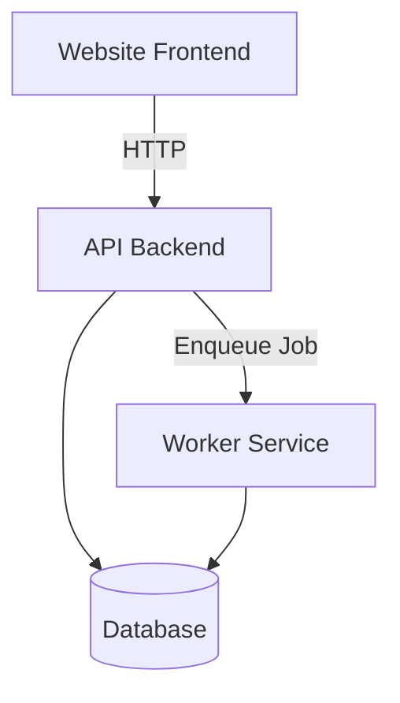

# Architecture Diagram

```mermaid
graph TD;
  Frontend[Website Frontend]
  API[API Backend]
  Worker[Worker Service]
  DB[(Database)]
  Frontend -->|HTTP| API
  API -->|Enqueue Job| Worker
  API --> DB
  Worker --> DB
```

This diagram shows the high-level flow between the frontend, backend API, worker, and database.